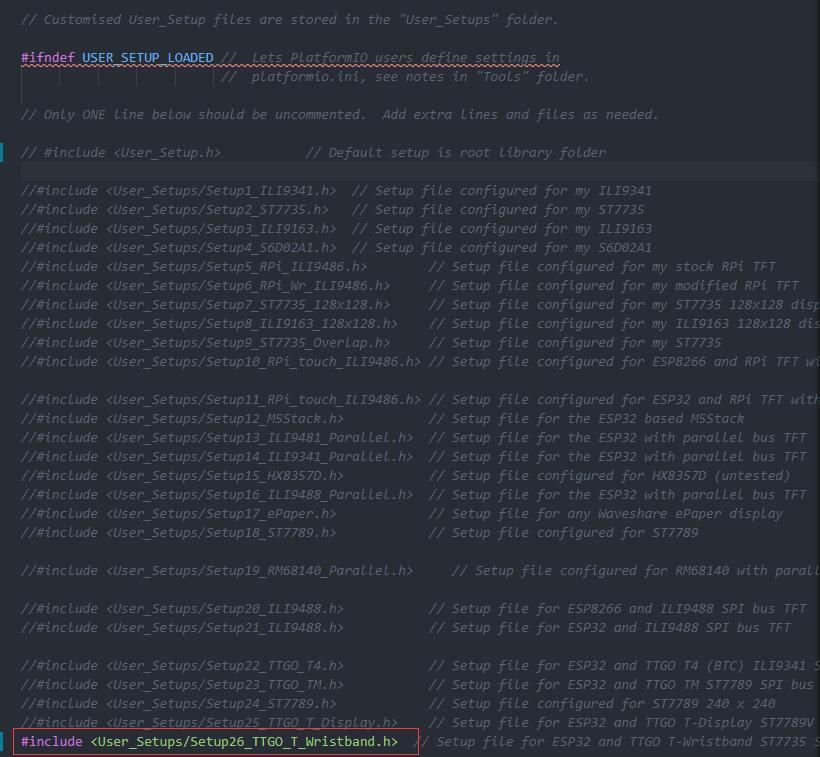

## **[English](../examples/T-Wristband-MAX3010X/README.MD) | 中文**

## 使用之前,请阅读下面的描述

1. 根据你使用的串口通讯板安装对应的驱动程序
   - [CP21xx Drivers](https://www.silabs.com/products/development-tools/software/usb-to-uart-bridge-vcp-drivers)
   - [CH340 Drivers](http://www.wch-ic.com/search?q=ch340&t=downloads)

2. 安装下面列表中的依赖库,默认已将所需要的库文件放置在`libdeps`目录中,请将`libdeps`目录内所有文件拷贝到`C:\<UserName>\Documents\Arduino\libraries`目录内
   - [TFT_eSPI](https://github.com/Bodmer/TFT_eSPI)
   - [SparkFun_MAX3010x_Sensor_Library](https://github.com/sparkfun/SparkFun_LSM9DS1_Arduino_Library)

3. 配置TFT头文件(**如果使用`libdeps`目录中库文件,可以跳过这一步**)
    - 在你的库文件夹目录中找到**TFT_eSPI**目录
    - 在**TFT_eSPI**根目录中找到`User_Setup_Select.h`并且打开进行编辑
    - 将 文件头部`#include <User_Setup.h>` 注释掉
    - 找到 `#include <User_Setups/Setup26_TTGO_T_Wristband.h>`,取消前面的注释,保存退出
    - 最终效果如下图:
        
4. 板子可以选择**ESP32 Dev Module**，其他设置可以保持默认,注意 `T-Wristband` 没有使用PSRAM,请勿开启PSRAM,和调用PSRAM的功能函数

5. 更多心率示例请参考`SparkFun_MAX3010x_Sensor_Library`

## 数据手册
- [lsm9ds1 Sensor](https://www.st.com/resource/en/datasheet/lsm9ds1.pdf)
- [ST7735](http://www.displayfuture.com/Display/datasheet/controller/ST7735.pdf)
- [ESP32-PICO-D4](https://www.espressif.com/sites/default/files/documentation/esp32-pico-d4_datasheet_en.pdf)
- [MAX30102](https://datasheets.maximintegrated.com/en/ds/MAX30102.pdf)
  

## 引脚定义
| Name         | Pin |
| ------------ | --- |
| MAX3010X_SDA | 15  |
| MAX3010X_SCL | 13  |
| MAX3010X_IRQ | 4   |

